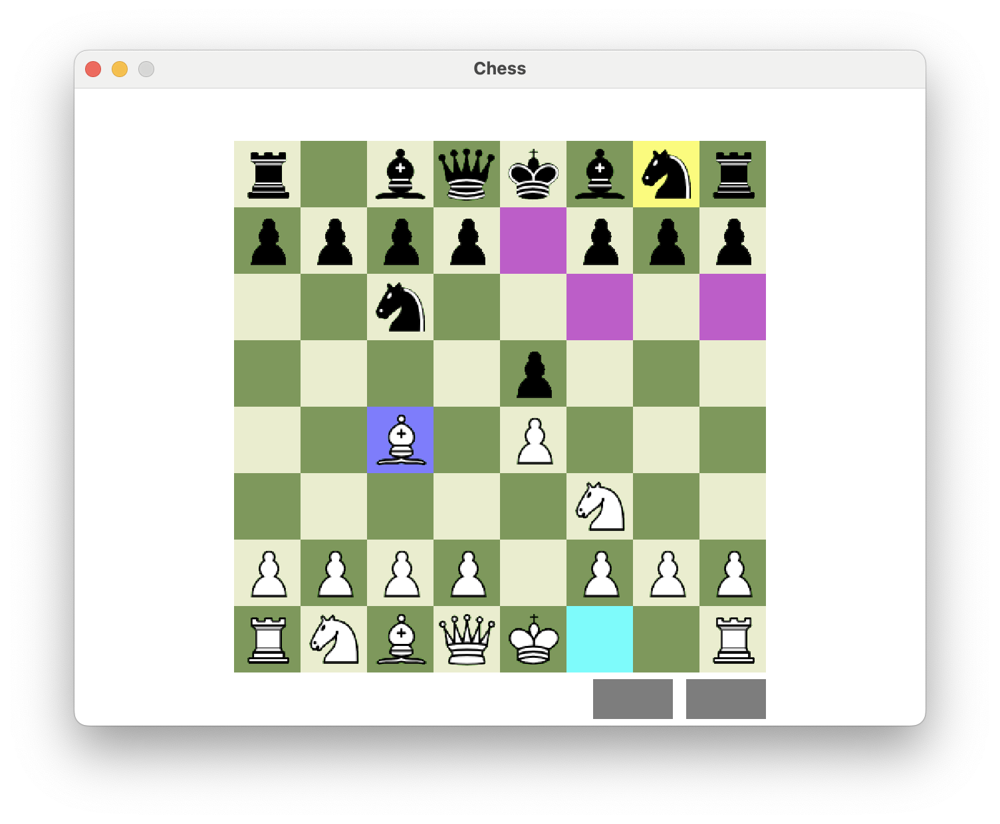

# Chess

A chess engine and desktop app written in C++

Features:

- a bitboard-based engine with legal move generation, undo/redo, and perft support
- a desktop app built with raylib
- Catch2 tests for engine and perft
- a debug hot-reload workflow for app code

This project is set up for local development on macOS with Xcode-generated builds.

## Repository Layout

- `modules/engine`: chess rules, move generation, perft, and tests
- `modules/app`: desktop application UI
- `modules/common`: shared types and utilities
- `scripts`: helper scripts for generating builds, building raylib, and hot reload

## Setup

1. Clone the repository with submodules:

```bash
git clone --recurse-submodules git@github.com:tim95bell/chess.git
cd chess
```

2. Build and install raylib into `./libs`:

```bash
./scripts/build_raylib.sh
```

## Build

Debug build:

```bash
./scripts/generate_build_debug.sh
cmake --build build/chess/debug
```

Release build:

```bash
./scripts/generate_build_release.sh
cmake --build build/chess/release
```

## Run

Debug:

```bash
./build/chess/debug/modules/app/Debug/chess
```

Release:

```bash
./build/chess/release/modules/app/Release/chess
```

## Tests

Engine tests:

```bash
./build/chess/debug/modules/engine/test/Debug/chess_engine_tests
```

Perft executable:

```bash
./build/chess/debug/modules/engine/perft/Debug/chess_engine_perft
```

## Hot Reload

Run the debug app, then rebuild the hot-reload target when you want to swap in updated app code:

```bash
./build/chess/debug/modules/app/Debug/chess
./scripts/hot_reload_debug.sh
```

## Third-Party Assets

Third-party asset attributions and licenses are listed in [THIRD_PARTY.md](THIRD_PARTY.md).

## Screenshot

